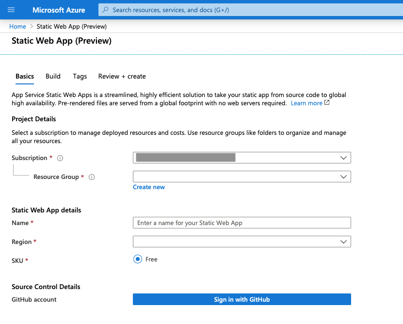
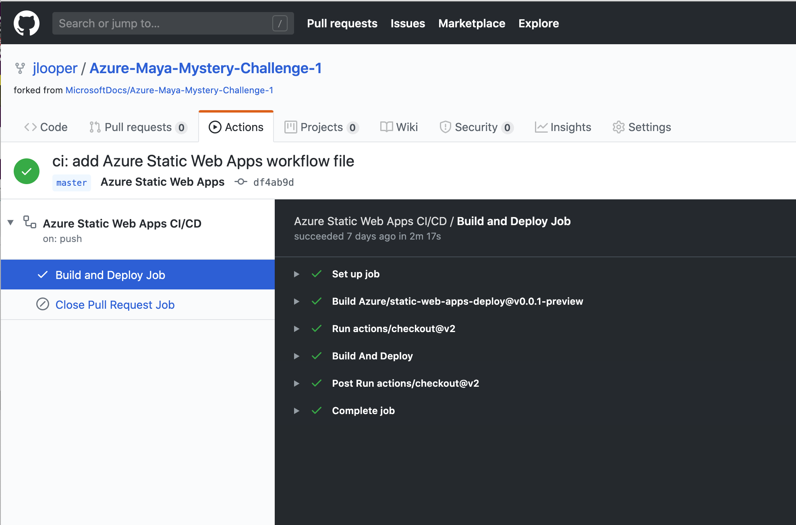

# A Chat with A Deity 🌧🌈

This project was bootstrapped with [Create React App](https://github.com/facebook/create-react-app). If you run it locally via `npm run start` you will be able to view the chat locally (on http://localhost:3000). But we'd like you to try it on Azure Static Sites!

> You can read more about how to build and host Azure Static Sites on the Microsoft [Docs](https://docs.microsoft.com/azure/static-web-apps/overview?WT.mc_id=mayamystery-github-jelooper). You can also walk through how to publish your static sites to Azure on Microsoft [Learn](https://docs.microsoft.com/en-us/learn/modules/publish-app-service-static-web-app-api?WT.mc_id=mayamystery-github-jelooper)

To do this, follow these steps:

1. Fork this repo to your own GitHub account and either login to the [Azure Portal](https://aka.ms/trystaticwebapps) or use this button to deploy your code to the portal:

2. Walk through the app creation wizard to connect your GitHub repo that you forked previously to create a new static web app.

3. You don't need to make changes to configure paths for the new app - the service will create a workflow file in a new folder in your repo and use it to leverage GitHub Actions to build your app.

4. Watch your GitHub Actions for the build to complete, and enjoy the chat in the URL provided by Azure Static Web Apps!

🌈You will learn the name of the first mysterious blue glyph; return to the Azure Maya Mystery game and input it in the box to continue!🌈
